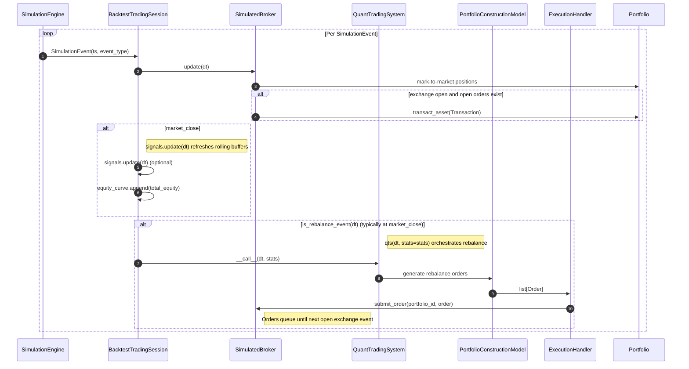
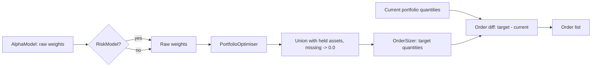

# Backtest Data Flow

## Procedure and data flow for a backtest session

**Contents**

- [1) Session setup (`BacktestTradingSession`)](#1-session-setup-backtesttradingsession)
- [2) Event-driven timeline (per business day)](#2-event-driven-timeline-per-business-day)
  - [2.1) How the rebalance schedule is generated](#21-how-the-rebalance-schedule-is-generated)
- [3) Core loop behavior by event](#3-core-loop-behavior-by-event)
  - [3.1) What `broker.update(dt)` does behind the scenes](#31-what-brokerupdatedt-does-behind-the-scenes)
  - [3.2) What `signals.update(dt)` does behind the scenes](#32-what-signalsupdatedt-does-behind-the-scenes)
  - [3.3) What `qts(dt, stats=stats)` does behind the scenes](#33-what-qtsdt-statsstats-does-behind-the-scenes)
  - [3.4) Where `submit_order(...)` is called in the backtest workflow](#34-where-submit_order-is-called-in-the-backtest-workflow)
  - [3.5) Where open orders are checked and executed](#35-where-open-orders-are-checked-and-executed)
- [4) Rebalance pipeline (`PortfolioConstructionModel`)](#4-rebalance-pipeline-portfolioconstructionmodel)
- [5) Broker execution and accounting path](#5-broker-execution-and-accounting-path)
  - [5.1) Exchange gate and execution lifecycle details](#51-exchange-gate-and-execution-lifecycle-details)
- [6) End products from `run()`](#6-end-products-from-run)
- [Key data types at each boundary](#key-data-types-at-each-boundary)
- [Sequence diagram (compact)](#sequence-diagram-compact)
- [Portfolio construction flowchart (tiny)](#portfolio-construction-flowchart-tiny)

This consolidates the execution path documented in `docs/trading.md`, `docs/simulation.md`, `docs/portcon.md`, and `docs/broker.md`.

### 1) Session setup (`BacktestTradingSession`)

At construction time, the session wires together:

- `DailyBusinessDaySimulationEngine` to generate a time-ordered stream of events.
- `SimulatedBroker` (with `Exchange`, `BacktestDataHandler`, `FeeModel`) to price and execute orders.
- `QuantTradingSystem` (`AlphaModel` + optional `RiskModel` + `PortfolioConstructionModel`) to create rebalance orders.
- Rebalance schedule (`daily`, `weekly`, `end_of_month`, or `buy_and_hold`) and optional `SignalsCollection`.
- Cash/account bootstrap via broker account + portfolio funding calls.

### 2) Event-driven timeline (per business day)

`DailyBusinessDaySimulationEngine` can yield four ordered events:

1. `pre_market` (00:00 UTC)
2. `market_open` (14:30 UTC)
3. `market_close` (21:00 UTC)
4. `post_market` (23:59 UTC)

In the default `BacktestTradingSession` wiring, the simulation engine is created with `pre_market=False` and `post_market=False`, so the active loop events are typically `market_open` and `market_close` only.

### 2.1) How the rebalance schedule is generated

The rebalance schedule is **precomputed once** during `BacktestTradingSession` construction and stored as `self.rebalance_schedule`, a `list[pd.Timestamp]`.

The creation flow is:

1. `BacktestTradingSession.__init__` stores the user-selected `rebalance` mode (such as `buy_and_hold`, `daily`, `weekly`, or `end_of_month`).
2. It calls `_create_rebalance_event_times()` to build the full schedule for the backtest date range.
3. That helper instantiates one concrete rebalance class and returns its `.rebalances` list.
4. Later, the run loop checks `is_rebalance_event(dt)` by testing whether the current event timestamp is a member of that precomputed list.

The supported schedule generators are:

- `BuyAndHoldRebalance` — one rebalance at the first eligible business-day timestamp near `start_dt`.
- `DailyRebalance` — every business day at the rebalance timestamp used by the simulation.
- `WeeklyRebalance` — a specified weekday (for example `WED`) across the backtest range; this mode requires `rebalance_weekday`.
- `EndOfMonthRebalance` — the last business day of each month across the backtest range.

Operationally, this means rebalance timing is **not recalculated on every loop iteration**. Instead, the session computes all rebalance datetimes up front, then uses a simple membership check to decide when `qts(dt, stats=stats)` should run.

### 3) Core loop behavior by event

```text
for event in simulation_engine:
    dt = event.ts

    # Always refresh portfolio pricing; execute queued orders only if exchange is open.
    broker.update(dt)

    if event_type == "market_close":
        signals.update(dt)                       # optional
        if dt >= burn_in_dt:
            equity_curve.append((dt, broker.get_account_total_equity()))

    if is_rebalance_event(dt) and dt >= burn_in_dt:  # rebalance condition: dt is in precomputed rebalance_schedule
        qts(dt, stats=stats)                     # execute rebalance; triggers portfolio construction + order submission
```

### 3.1) What `broker.update(dt)` does behind the scenes

Although it appears as a single call in the session loop, `broker.update(dt)` performs several state transitions:

1. **Advance broker time** — The broker moves its internal clock to `dt`. Time is expected to be monotonic; backward moves are invalid.
2. **Mark every held position to market** — For each portfolio and each currently-held asset, the broker asks `BacktestDataHandler` for the latest **mid price** at `dt`, then updates the portfolio's stored market value for that asset. This happens even when the exchange is closed.
3. **Check whether the exchange is open** — The broker calls `exchange.is_open_at_datetime(dt)`. If the answer is false, no queued orders are executed and the update ends after mark-to-market.
4. **Drain queued orders when open** — If the exchange is open, queued orders are pulled from broker-managed order queues across portfolios.
5. **Sort execution order by direction** — Sell/short orders are executed before buy orders so that cash can be freed before subsequent purchases.
6. **Price each order using bid/ask** — For every queued order, the broker fetches the latest `(bid, ask)` pair from `BacktestDataHandler`; buys fill at the **ask**, sells fill at the **bid**.
7. **Estimate transaction cost** — The broker calculates trade consideration from execution price and quantity, then asks `FeeModel.calc_total_cost(...)` for commissions/fees.
8. **Create a `Transaction` and mutate portfolio state** — The broker builds a `Transaction(...)` object and passes it to `Portfolio.transact_asset(...)`, which updates the `Position`, adjusts cash, records a `PortfolioEvent`, and refreshes aggregate portfolio totals such as market value, equity, and PnL.
9. **Leave any non-executable orders queued until a later open event** — Orders submitted when the venue is closed (commonly at `market_close` in the default session) persist until a later `broker.update(dt)` occurs while the exchange is open.

In short, `broker.update(dt)` has a dual role: it is both the **mark-to-market valuation step** for all existing holdings and the **execution engine entry point** for any orders already waiting in the broker queue.

### 3.2) What `signals.update(dt)` does behind the scenes

At `market_close`, `signals.update(dt)` refreshes the internal state that alpha and risk models read later during rebalancing. Although it appears as one call, it performs a coordinated rolling-data update:

1. **Refresh each signal's active asset set** — For every managed `Signal`, the collection asks the associated universe for `universe.get_assets(dt)`. Newly-eligible assets are added, while assets that are no longer in the current universe are removed from the signal's tracked state.
2. **Fetch the latest market price for each tracked asset** — For each signal/asset pair, the signal layer requests the latest **mid price** from `BacktestDataHandler` at `dt`.
3. **Append prices into rolling buffers** — Each fetched price is pushed into that signal's `AssetPriceBuffers`. Internally, buffers are fixed-length deques keyed by asset and lookback period, so older observations fall off automatically once the buffer is full.
4. **Maintain lookback-specific history** — Simple indicators keep exactly `lookback` prices, while return/volatility-style indicators may internally keep `lookback + 1` prices so that period-to-period changes can be computed correctly.
5. **Advance signal warmup state** — After all prices are appended, the collection increments its warmup counter, which allows downstream models to determine whether enough history has accumulated to trust a signal value.
6. **Expose updated signal values to later stages** — After the update completes, alpha models and risk models can query the collection/signals for current indicator values derived from the refreshed buffers.

In short, `signals.update(dt)` is the **rolling market-data ingestion step** for the research layer: it keeps each signal's asset membership, lookback history, and warmup state synchronized with the latest close so the next rebalance decision uses up-to-date indicators.

### 3.3) What `qts(dt, stats=stats)` does behind the scenes

When the rebalance-event check passes, `qts(dt, stats=stats)` invokes the `QuantTradingSystem` and performs the full **decision-to-order-submission** pipeline:

1. **Enter `QuantTradingSystem.__call__`** — The system acts as the orchestration layer for rebalance-time logic. Its job is to ask portfolio construction for rebalance orders and then pass those orders to the execution layer.
2. **Run portfolio construction** — `PortfolioConstructionModel.__call__(dt, stats=stats)` generates target portfolio intent from the current market/signal state.
3. **Generate target weights** — The portfolio construction model calls `AlphaModel(dt)` to obtain raw weights, optionally passes them through `RiskModel(dt, weights)`, and then applies the configured `PortfolioOptimiser`.
4. **Expand weights to a full tradable set** — Current holdings are unioned with current universe assets so that assets already held but no longer desired receive target weight `0.0` and can be liquidated.
5. **Persist target allocations into `stats`** — Before sizing orders, the portfolio construction layer appends a snapshot of the target allocation map for `dt` into `stats['target_allocations']`. This is what later becomes `BacktestTradingSession.target_allocations`.
6. **Size target positions** — The `OrderSizer` converts target weights into integer share quantities using broker/account state, current prices, and any long-only cash buffer or long/short leverage rules.
7. **Compare target vs current holdings** — The model queries `broker.get_portfolio_as_dict(...)`, computes quantity deltas for each asset, and creates a `list[Order]` containing only non-zero rebalance trades.
8. **Hand orders to execution** — `ExecutionHandler.__call__(dt, rebalance_orders)` applies the configured `ExecutionAlgorithm` and, in the default backtest setup, submits the resulting orders to the broker.
9. **Trigger broker-side queueing/execution** — With `submit_orders=True`, each submitted order is passed to `broker.submit_order(...)`, followed by `broker.update(dt)`. Whether those orders execute immediately or remain queued depends on the exchange-open check described in `### 3.1)` and `### 5.1)`.

In short, `qts(dt, stats=stats)` is the **rebalance orchestration step**: it turns updated signals and current portfolio state into target weights, sized positions, submitted orders, and a recorded snapshot of target allocations.

### 3.4) Where `submit_order(...)` is called in the backtest workflow

`submit_order(...)` is not called directly from `BacktestTradingSession.run()`. It is called indirectly through the quant system execution chain:

1. The run loop hits a rebalance event and calls `qts(dt, stats=stats)`.
2. `QuantTradingSystem.__call__(...)` generates `rebalance_orders` via portfolio construction.
3. `ExecutionHandler.__call__(dt, rebalance_orders)` iterates final orders.
4. For each order (when `submit_orders=True`), it calls `broker.submit_order(self.broker_portfolio_id, order)` and then `broker.update(dt)`.

So the concrete submit path is:

`BacktestTradingSession.run` -> `qts(...)` -> `ExecutionHandler.__call__(...)` -> `broker.submit_order(...)`

After submission, orders enter the broker queue and are executed immediately only if the exchange-open check in `broker.update(dt)` passes.

### 3.5) Where open orders are checked and executed

Open orders are checked/executed inside `SimulatedBroker.update(dt)`, which is called from two places in the backtest flow:

1. **Every simulation event** in `BacktestTradingSession.run()` via `self.broker.update(dt)`.
2. **Immediately after each submitted order** in `ExecutionHandler.__call__` via `self.broker.update(dt)`.

Within `SimulatedBroker.update(dt)`, the execution path is:

1. Check venue state with `exchange.is_open_at_datetime(self.current_dt)`.
2. If open, drain per-portfolio order queues from `self.open_orders[...]`.
3. Sort drained orders by `order.direction` (short/sell first, then long/buy).
4. Execute each order via `_execute_order(dt, portfolio_id, order)`.

If the exchange is closed, orders remain queued in `self.open_orders` and are retried on a later `broker.update(dt)` call when the exchange is open.

### 4) Rebalance pipeline (`PortfolioConstructionModel`)

When rebalancing is triggered, data flows through these stages:

1. `AlphaModel(dt)` -> raw `weights: dict[asset, float]`
2. `RiskModel(dt, weights)` -> risk-adjusted weights (optional)
3. `PortfolioOptimiser(dt, initial_weights)` -> optimised weights
4. Union with current holdings to include liquidation candidates (missing assets get weight `0.0`)
5. `OrderSizer(dt, full_weights)` -> target share quantities
6. `broker.get_portfolio_as_dict(...)` -> current share quantities
7. Delta calc (`target - current`) -> incremental `list[Order]`
8. `ExecutionHandler` submits orders to `broker.submit_order(...)` (queued for later execution)

### 5) Broker execution and accounting path

For the detailed execution mechanics of `broker.update(dt)`—mark-to-market refresh, exchange-open gating, queue draining, bid/ask fill pricing, and fee calculation—see `### 3.1)` above and `### 5.1)` below.

At the accounting boundary, the key hand-off is:

`SimulatedBroker` -> `Transaction(...)` -> `Portfolio.transact_asset(...)`

From that point onward, the portfolio layer applies the fill and updates state.

Accounting side effects after a fill:

- Position state updates (`buy/sell quantities`, `avg prices`, `realised/unrealised PnL`).
- Cash debited/credited by consideration plus commission.
- Portfolio event history append for auditability.
- Portfolio-level values recomputed (`total_market_value`, `total_equity`, aggregate PnL).

### 5.1) Exchange gate and execution lifecycle details

- `Exchange` exposes one critical contract: `is_open_at_datetime(dt) -> bool`; broker execution is gated on this check.
- `SimulatedExchange` models weekday-only NYSE-style hours (`14:30 <= t < 21:00` UTC), and localises naive timestamps to UTC before comparison.
- Rebalance output (`list[Order]`) flows into `ExecutionHandler.__call__(dt, rebalance_orders)`, which first applies `ExecutionAlgorithm`, then submits orders.
- Default backtest execution uses `MarketOrderExecutionAlgorithm`, a pass-through implementation that leaves order lists unchanged.
- With `submit_orders=True` (default in backtests), the execution handler submits each order via `broker.submit_order(...)` and triggers `broker.update(dt)`.
- If the exchange is closed at that `dt`, orders remain queued and are executed on the next open-event update; this creates a clear submit-now/execute-later boundary.
- `submit_orders=False` is useful for dry-run analysis of portfolio construction and order generation without mutating broker state.

### 6) End products from `run()`

- `equity_curve`: chronological `(dt, total_equity)` points (after burn-in, typically at `market_close`).
- `target_allocations`: rebalance-time target allocations produced by portfolio construction.

## Key data types at each boundary

| Hand-off point | Type |
|---|---|
| `SimulationEngine` -> main loop | `SimulationEvent(ts: pd.Timestamp, event_type: str)` |
| `AlphaModel` -> `RiskModel` / optimiser | `dict[str, float]` |
| `PortfolioOptimiser` -> `OrderSizer` | `dict[str, float]` |
| `OrderSizer` -> rebalance diff | `dict[str, dict]` (target quantities) |
| `PortfolioConstructionModel` -> `ExecutionHandler` | `list[Order]` |
| `ExecutionHandler` -> `SimulatedBroker` | `Order(dt, asset, quantity)` |
| `SimulatedBroker` -> `Portfolio` | `Transaction(asset, quantity, dt, price, commission)` |
| `broker.get_account_total_equity()` -> equity curve | `float` |

### Sequence diagram (compact)



Timing note:
- In the default session, rebalance orders are usually generated/submitted at `market_close`, when the exchange is already closed.
- Those queued orders are then eligible to fill on the next `market_open` `broker.update(dt)` (subject to exchange-open check).

### Portfolio construction flowchart (tiny)



Legend: `Current portfolio quantities` is sourced from `broker.get_portfolio_as_dict(...)`.

## Strategy logic (using `TopNMomentumAlphaModel` as an example)

1. **Universe** — All SPDR US sector ETFs (`XLB`, `XLC`, `XLE`, `XLF`, `XLI`, `XLK`, `XLP`, `XLU`, `XLV`, `XLY`). Because `XLC` was not listed until June 2018, a `DynamicUniverse` is used so it is only eligible from that date onwards.
2. **Signal** — 126-business-day (≈ 6-month) holding-period return momentum, calculated via `MomentumSignal`.
3. **Alpha Model (`TopNMomentumAlphaModel`)** — At each rebalance event, ranks every eligible asset by its momentum score and assigns an **equal weight of 1/N** to the top-N assets (N = 3 by default). All other assets receive a weight of 0.
4. **Rebalance** — `end_of_month` (the last trading day of every calendar month).
5. **Burn-in** — The first year of data (1999-01-01) is used purely for signal warm-up; performance statistics begin after that date.
6. **Benchmark** — A static 100 % allocation to SPY using `FixedSignalsAlphaModel` with a `buy_and_hold` rebalance schedule.
---

# Code Review

## Links to .md files
- [Alpha Model (`qstrader.alpha_model`)](docs/alpha_model.md)
- [Asset (`qstrader.asset`)](docs/asset.md)
- [Broker (`qstrader.broker`)](docs/broker.md)
- [Data (`qstrader.data`)](docs/data.md)
- [Exchange (`qstrader.exchange`)](docs/exchange.md)
- [Execution (`qstrader.execution`)](docs/execution.md)
- [Portfolio Construction (`qstrader.portcon`)](docs/portcon.md)
- [Risk Model (`qstrader.risk_model`)](docs/risk_model.md)
- [Signals (`qstrader.signals`)](docs/signals.md)
- [Simulation (`qstrader.simulation`)](docs/simulation.md)
- [Statistics (`qstrader.statistics`)](docs/statistics.md)
- [System (`qstrader.system`)](docs/system.md)
- [Trading (`qstrader.trading`)](docs/trading.md)
- [Utils (`qstrader.utils`)](docs/utils.md)

## Links to .html files
- [Alpha Model (`qstrader.alpha_model`)](docs/html/alpha_model/)
- [Asset (`qstrader.asset`)](docs/html/asset/)
- [Broker (`qstrader.broker`)](docs/html/broker/)
- [Data (`qstrader.data`)](docs/html/data/)
- [Exchange (`qstrader.exchange`)](docs/html/exchange/)
- [Execution (`qstrader.execution`)](docs/html/execution/)
- [Portfolio Construction (`qstrader.portcon`)](docs/html/portcon/)
- [Risk Model (`qstrader.risk_model`)](docs/html/risk_model/)
- [Signals (`qstrader.signals`)](docs/html/signals/)
- [Simulation (`qstrader.simulation`)](docs/html/simulation/)
- [Statistics (`qstrader.statistics`)](docs/html/statistics/)
- [System (`qstrader.system`)](docs/html/system/)
- [Trading (`qstrader.trading`)](docs/html/trading/)
- [Utils (`qstrader.utils`)](docs/html/utils/)

## Package dependencies

Level 0 — no qstrader dependencies

 1. - [x] qstrader.constants
 2. - [x] qstrader.settings
 3. - [x] qstrader.utils

Level 1 — depends only on Level 0

 4. - [x] qstrader.asset
 5. - [x] qstrader.exchange
 6. - [x] qstrader.simulation
 7. - [x] qstrader.risk_model

Level 2 — depends on Level 0-1

 8. - [x] qstrader.data           → asset
 9. - [x] qstrader.statistics     → settings
10. - [x] qstrader.alpha_model    → asset

Level 3 — depends on Level 0-2

11. - [x] qstrader.signals        → asset, data

Level 4 — cyclic package pair on top of Level 0-3

12. - [x] qstrader.execution      → asset, broker, data
13. - [x] qstrader.broker         → execution, data, exchange, settings

Level 5 — depends on Level 0-4

14. - [x] qstrader.portcon        → execution, broker, asset, alpha_model, risk_model, data

Level 6 — depends on Level 0-5

15. - [x] qstrader.system         → asset, broker, data, alpha_model, portcon, execution

Level 7 — depends on everything

16. - [x] qstrader.trading        → alpha_model, asset, broker, data, exchange,
                                    risk_model, signals, simulation, system, settings

Key observations:
Packages at the same level are independent of each other and can be reviewed in any order within that level.
risk_model and simulation are pure abstract/interface packages with no cross-package imports — they sit at level 1 alongside asset and exchange.
`qstrader.execution` and `qstrader.broker` form a cyclic dependency: `execution_handler.py` imports `qstrader.broker.broker.Broker`, while `broker.py` imports `qstrader.execution.order.Order`.
trading.backtest is the integration layer and touches every other package — it belongs at the end.

## Package descriptions

Visualization:
- Graphviz Online: https://dreampuf.github.io/GraphvizOnline/
- webgraphviz: http://www.webgraphviz.com/

### alpha_model

This package contains the AlphaModel class and its subclasses, which define the interface for an alpha model. 
Essentially, an alpha model is a function that takes in a set of signals and outputs a dictionary of signal weights for 
each asset in the current universe. 

The subclasses of AlphaModel include FixedSignalsAlphaModel, which returns a fixed dictionary of signal weights, and 
SingleSignalAlphaModel, which applies one scalar signal to all current universe assets.

- [x] alpha_model.py::AlphaModel, abstract class that defines the interface for an alpha model.
  - fixed_signals.py::FixedSignalsAlphaModel, subclass of AlphaModel that returns a fixed dictionary of signal weights.
  - single_signal.py::SingleSignalAlphaModel, subclass of AlphaModel that applies one scalar signal to all current universe assets.
  
- [x] unit test: uv run pytest tests/unit/alpha_model/

### asset

This package contains the Asset class and its subclasses, which store meta data about trading assets. The Asset class 
is an abstract class that defines the interface for a trading asset. The subclasses of Asset include Cash, which 
represents cash as a trading asset, and Equity, which stores meta data about an equity common stock or ETF.

This package also contains the Universe class and its subclasses, which define the interface for an Asset Universe. The 
Universe class is an abstract class that defines the interface for an Asset Universe. The subclasses of Universe include 
DynamicUniverse, which associates assets with their "start date", and StaticUniverse, which does not change.

- [x] asset.py::Asset, abstract class that stores meta data about a trading asset.
  - cash.py::Cash, subclass of Asset that represents cash as a trading asset.
  - equity.py::Equity, subclass of Asset that stores meta data about an equity common stock or ETF.

- [x] universe.py::Universe, interface specification for an Asset Universe. 
  - dynamic.py::DynamicUniverse, subclass of Universe that that associates an asset with a datetime that serves as the asset's 'start date' in the universe.
  - static.py::StaticUniverse, subclass of Universe that does not change its composition through time.

- [x] unit test: uv run pytest tests/unit/asset/

### broker

- [x] broker.py::Broker, abstract class that defines the interface for a broker.
  - simulated_broker.py::SimulatedBroker, subclass of Broker that simulates a broker for backtesting purposes.
  
- [x] fee_model.py::FeeModel, abstract class that defines the interface for a fee model.
  - fixed_fee_model.py::FixedFeeModel, subclass of FeeModel that applies a fixed fee per trade.
  - percentage_fee_model.py::PercentageFeeModel, subclass of FeeModel that applies a percentage fee per trade.
  
- [x] transaction.py::Transaction, class that defines the interface for a transaction.
- [x] portfolio.py::Portfolio, class that defines the interface for a portfolio.
- [x] portfolio_event.py::PortfolioEvent, class that defines the interface for a portfolio event.
- [x] position.py::Position, class that defines the interface for a position.
- [x] position_handler.py::PositionHandler, class that defines the interface for a position handler.

- [x] unit test: uv run pytest tests/unit/broker/

### data

This package contains the CSVDailyBarDataSource class and the BacktestDataHandler class.

The CSVDailyDataSource class encapsulates loading, preparation and querying of CSV files of daily 'bar' OHLCV data. The 
CSV files are converted into a intraday timestamped Pandas DataFrame with opening and closing prices.

The BacktestDataHandler class is essentially a wrapper around the CSVDailyBarDataSource class (along with an asset universe), 
and provides an asset's latest bid, ask, and mid prices, as well as the historical range close prices.

- [x] backtest_data_handler.py::BacktestDataHandler, provides an asset's latest bid, ask, and mid prices, as well as the historical range close prices. 
- [x] daily_bar_csv.py::CSVDailyBarDataSource, encapsulates loading, preparation and querying of CSV files of daily 'bar' OHLCV data. The CSV files are converted into a intraday
    timestamped Pandas DataFrame with opening and closing prices.

- [x] unit test: uv run pytest tests/unit/data/

### exchange

This package contains the Exchange class and its subclasses, which define the interface for an exchange. The main 
function of an exchange is the is_open_at_datetime(...) method, which returns True if the exchange is open at a given 
datetime, and False otherwise.

- [x] exchange.py::Exchange, abstract class that defines the interface for an exchange.
  - simulated_exchange.py::SimulatedExchange, subclass of Exchange that simulates an exchange for backtesting purposes.

- Backtest behavior notes:
  - `SimulatedExchange` uses weekday-only, fixed UTC market hours (`14:30` open, `21:00` close).
  - Naive timestamps are localised to UTC before open/closed checks.
  - Order execution in `broker.update(dt)` is gated by `is_open_at_datetime(dt)`.
  
- [x] unit test: uv run pytest tests/unit/exchange/

### execution

This package provides the order representation and execution management layer for QSTrader. It handles the lifecycle of 
trade orders generated by portfolio construction and bridges the gap between target portfolio rebalance requests and 
brokerage execution.

The package consists of two main abstractions:

1) Order Data Container: Order represents an explicit order to buy or sell a specified quantity of an asset.
2) Execution Management: ExecutionHandler routes rebalance orders through an execution algorithm and submits them to the broker.
3) Execution Algorithms (execution_algo): ExecutionAlgorithm and its concrete implementation MarketOrderExecutionAlgorithm define strategies for transforming or timing orders before submission.


- [x] order.py::Order, class that defines the interface for an order.
- [x] execution_handler.py::ExecutionHandler, class that defines the interface for an execution handler.

- [x] execution_algo.py::ExecutionAlgorithm, class that defines the interface for an execution algorithm.
  - market_order.py::MarketOrderExecutionAlgorithm, subclass of ExecutionAlgorithm that represents a market order.

- Backtest behavior notes:
  - `ExecutionHandler` applies `ExecutionAlgorithm` before submission.
  - Default `MarketOrderExecutionAlgorithm` is pass-through (no order transformation).
  - With `submit_orders=True`, orders are submitted then `broker.update(dt)` is triggered per order.
  - `submit_orders=False` supports dry-run validation of rebalance outputs.
  
- [ ] unit test
  
### portcon

- [x] optimiser.py::PortfolioOptimiser, abstract class that defines the interface for a portfolio optimiser.
  - equal_weight.py::EqualWeightPortfolioOptimiser, subclass of PortfolioOptimiser that implements an equal weight optimiser.
  - fixed_weight.py::FixedWeightPortfolioOptimiser, subclass of PortfolioOptimiser that implements a fixed weight optimiser.
  
- [x] order_sizer.py::OrderSizer, abstract class that defines the interface for an order sizer.
  - long_short.py::LongShortLeveragedOrderSizer, subclass of OrderSizer that implements a long/short leveraged order sizer.
  - dollar_weighted.py::DollarWeightedCashBufferedOrderSizer, subclass of OrderSizer that implements a dollar-weighted cash buffered order sizer.

- [x] pcmp.py::PortfolioConstructionModel, class that defines the interface for a portfolio construction model.

- [x] unit test: uv run pytest tests/unit/portcon/

### risk_model

This package currently has null implementations.

- [x] risk_model.py::RiskModel, abstract class that defines the interface for a risk model.

- [x] unit test: uv run pytest tests/unit/risk_model/
  
### signals

This package provides the indicator and signal generation layer for QSTrader. It manages rolling historical price data 
buffers and calculates technical indicators (such as simple moving averages, momentum, and annualized volatility) used 
by alpha models and risk models.

The package is built around four primary components:
1) Price Buffer Management — AssetPriceBuffers stores fixed-length double-ended queues (collections.deque) for individual asset lookback periods.
2) Abstract Base Interface — Signal defines the interface and lifecycle for lookback-based indicator calculations across a universe of assets.
3) Concrete Indicator Calculations — SMASignal, MomentumSignal, and VolatilitySignal compute specific quantitative time-series metrics.
4) Signal Aggregation & Data Updating — SignalsCollection aggregates multiple Signal instances and coordinates daily market price updates during simulation runs.

- [x] buffer.py::AssetPriceBuffers, class that defines the interface for an asset price buffer.

- [x] signal.py::Signal, class that defines the interface for a signal.
  - momentum.py::MomentumSignal, subclass of Signal that calculates the price momentum of an asset.
  - sma.py::SMASignal, subclass of Signal that calculates the price mean reversion of an asset.
  - vol.py::VolatilitySignal, subclass of Signal that calculates the price volatility of an asset.
  
- [x] signals_collection.py::SignalsCollection, class that defines the interface for a collection of signals.

- [x] unit test: uv run pytest tests/unit/signals/

### simulation

This package contains the SimulationEvent abstract class and the SimulationEngine abstract class. A concrete 
implementation of a SimulationEngine is the DailyBusinessDaySimulationEngine, which is an iterable object that yields 
"pre-market", "market-open", "market-close", and "post-market" SimulationEvents for each business day in the simulation period.

- [x] event.py::SimulationEvent, class that defines the interface for a simulation event.

- [x] sim_engine.py::SimulationEngine, class that defines the interface for a simulation engine.
  - daily_bday.py::DailyBusinessDaySimulationEngine, subclass of SimulationEngine that simulates a daily business day simulation engine.
  
- [x] unit test: uv run pytest tests/unit/simulation/

### statistics

This package contains the Statistics abstract class, which defines the interface for a statistics object that can be 
serialized to JSON. A concrete implementation of a Statistics object is the TearsheetStatistics class, which generates 
a Matplotlib 'one-pager' strategy performance report.

- [x] json_statistics.py::JSONStatistics, class that defines the interface for a statistics object that can be serialized to JSON.

- [x] performance.py
  - aggregate_returns(...), function that aggregates returns into a single return value.
  - create_cagr(...), function that calculates the compound annual growth rate (CAGR) of a return series.
  - create_sharpe_ratio(...), function that calculates the Sharpe ratio of a return series.
  - create_sortino_ratio(...), function that calculates the Sortino ratio of a return series.
  - calculate_drawdowns(...), function that calculates the drawdowns of a return series.
  
- [x] statistics.py::Statistics, class that defines the interface for a statistics object that can be serialized to JSON and generates a Matplotlib 'one-pager' strategy performance report.
  - tearsheet.py::TearsheetStatistics, subclass of Statistics that generates a Matplotlib 'one-pager' strategy performance report.
  
- [x] unit test: uv run pytest tests/unit/statistics/

### system

- [x] rebalance.py::Rebalance, abstract class that defines the interface for a rebalance event.
  - buy_and_hold.py::BuyAndHoldRebalance, subclass of Rebalance that implements a buy-and-hold rebalance event.
  - daily.py::DailyRebalance, subclass of Rebalance that implements a daily rebalance event.
  - end_of_month.py::EndOfMonthRebalance, subclass of Rebalance that implements an end-of-month rebalance event.
  - weekly.py::WeeklyRebalance, subclass of Rebalance that implements a weekly rebalance event.
  
- [x] qts.py::QuantTradingSystem, class that defines the interface for a quant system.

- [x] unit test: uv run pytest tests/unit/system/

### trading

- [x] trading_session.py::TradingSession, abstract class that defines the interface for a trading session.
  - backtest.py::BacktestTradingSession, subclass of TradingSession that implements a backtest trading session.
  
- [x] unit test: uv run pytest tests/unit/trading/

### utils

The only utility function in this package is string_colour(...), which returns a string with ANSI colour codes for terminal output.

- [x] console.py::string_colour(...), function that returns a string with ANSI colour codes for terminal output.

- [x] unit test: uv run pytest tests/unit/utils/test_console.py
